# Hacktoberfest BMCC

Hi! Temen-temen sekalian, ini adalah sebuah repository bagi temen-temen anggota BMCC atau yang bukan untuk mengikuti Hacktoberfest yang diadakan oleh Digitalocean dan BMCC.

> **Buat temen-temen yang belum pernah pake github, tenang aja...**
> 
> **Untuk repository ini kita buat beginer-friendly, jadi jangan khawatir tidak bisa, khawatir aja sama rasa 'mager' kalian.**

Nah, barangkali ada yang lupa ato emang belum tahu cara kontribusi di repo ini, abis ini bakal aku jelasin secara rinci dan detail!

Cuss langsung aja baca step-step dibawah ini... **Happy Hacking**!

---

## 1. Kontribusi apa yang bisa aku kasih buat repo ini?

Gampang aja, cukup tambahin code di source code yang ada di repo ini, kalian modif sesuka kalian tapi tetep harus ngikutin template yang ada yaa...

Kalo memang kalian punya ide yang menarik, ga masalah, hasil kontribusi kalian akan kita lihat terlebih dahulu sebelum kita merge ke branch master.

## 2. Gimana cara kontribusi di repo ini?

Sebelum kalian kontribute ke repo ini, jangan lupa buat akun github dulu yaa... kalo ga punya kalian ga bisa kontribute disini...

Jadi... Ada dua cara temen-temen, yaitu:

1. Pake GUI yang ada di Repo Github-nya
2. Pake Git di PC kalian

Untuk yang baru pertama kali pake github, silahkan untuk ikut cara yang nomer satu aja yaa...

Kalo yang udah merasa bisa pake Git, bisa ikut cara nomer dua yaa...

Gampang aja kok, ikuti instruksinya dengan runtut, saya jamin kalian auto bisa pake github. Tenang, ini aplikasi tidak berbahaya bagi jantung kalean wkwk...

### 2.1 Pake GUI Github

Oke sob, disini gua yang bakal jelasin ke kalean gimana sih caranya kontribute ke repo ini... baca yang runtut biar loe paham dan ga bingung, oke? Bagus!

1. Pertama buka github dulu

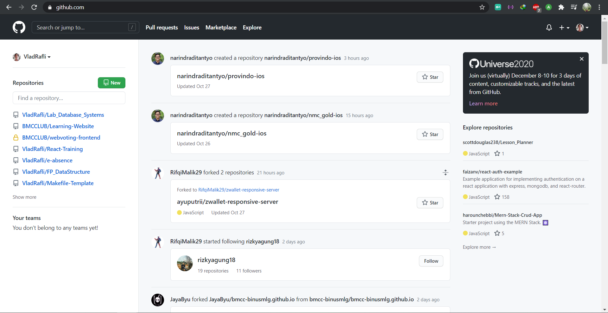

2. Buka repository Hacktoberfest BMCC di <https://github.com/bmcc-binusmlg/bmcc-binusmlg.github.io>

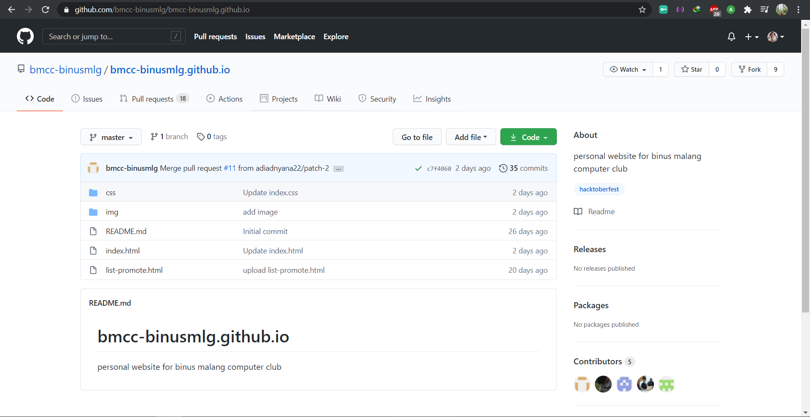

3. Fork repo-nya

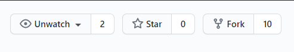

4. Masuk ke repo yang di-fork tadi (Ada di list repo github kalian)

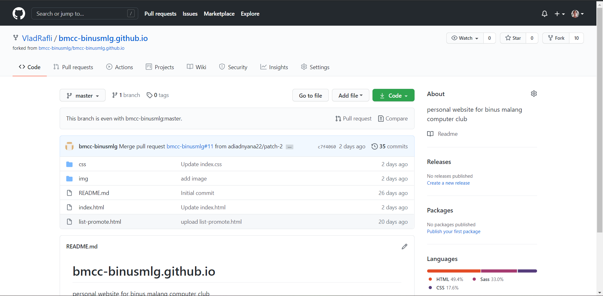

5. Pilih file yang mau diedit

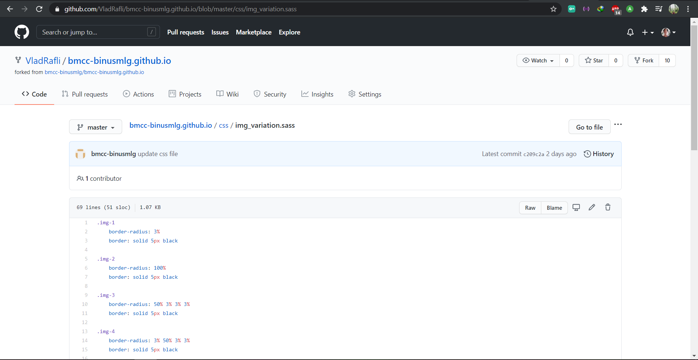

6. Edit file yang mau kalian edit, terus klik gambar pensil buat edit filenya

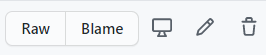

7. Tambahkan kode pada file

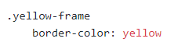

8. Commit perubahan file

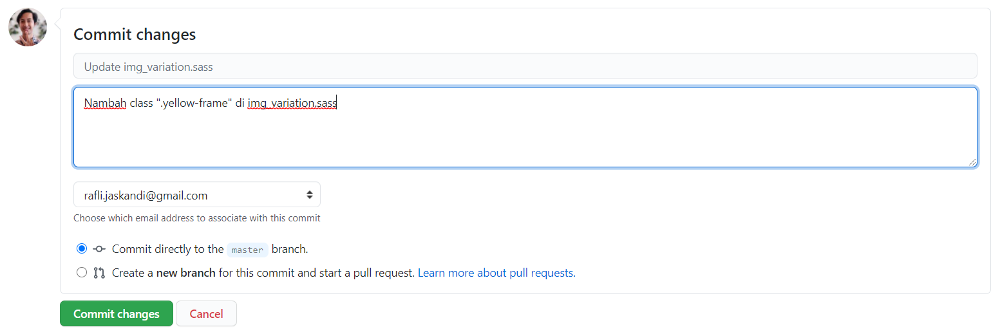

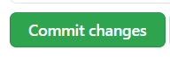

9. Buka menu Pull Request di repo kalian saat ini

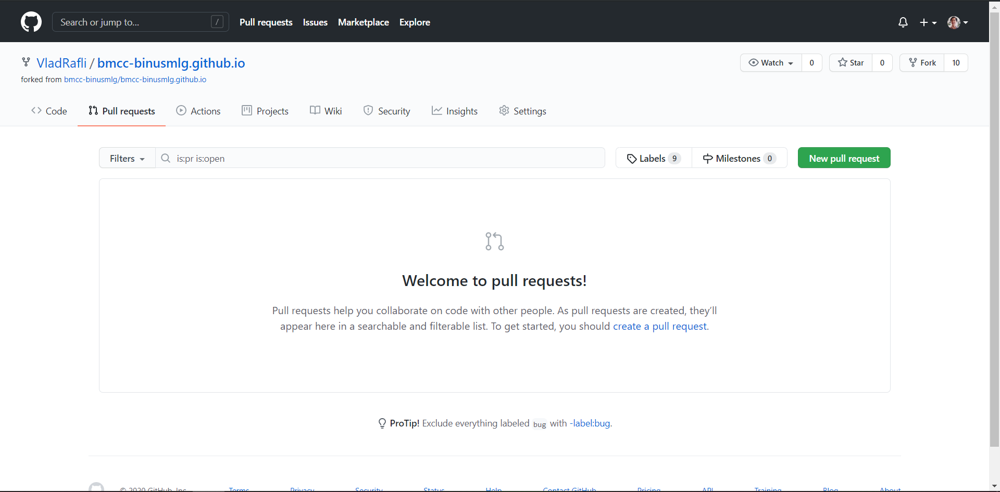

10. Setelah kalian klik new pull request, maka kalian akan diarahkan ke halaman ini

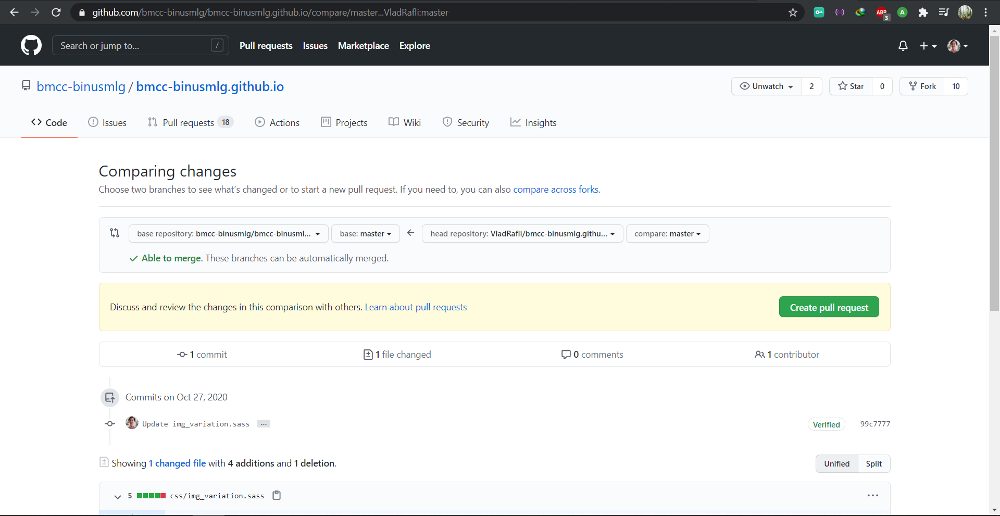

11. Lalu ketika kalian sudah yakin kodenya sudah benar, tinggal kalian klik create pull request

12. Lalu kalian disuruh untuk memastikan pull request yang kalian kirim, disini kalian diharapkan dapat memberikan penjelasan yang jelas agar moderator tidak bingung dengan pull request yang kalian buat

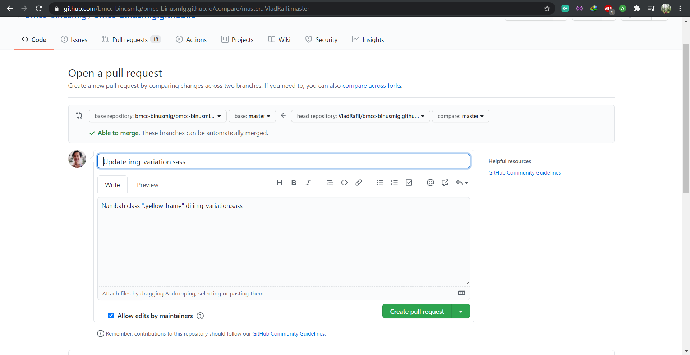

13. Setelah kalian selesai, maka Pull Request kalian telah terpost di menu PR Repo yang kalian ingin beri kontribusi

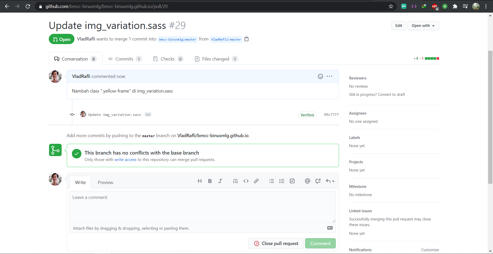

### 2.2 Pake Git Local PC

> **Sori! Bagian ini tidak saya isi terlebih dahulu**

## 3. Empty

> **Jangan berharap pada biji wijen ini**